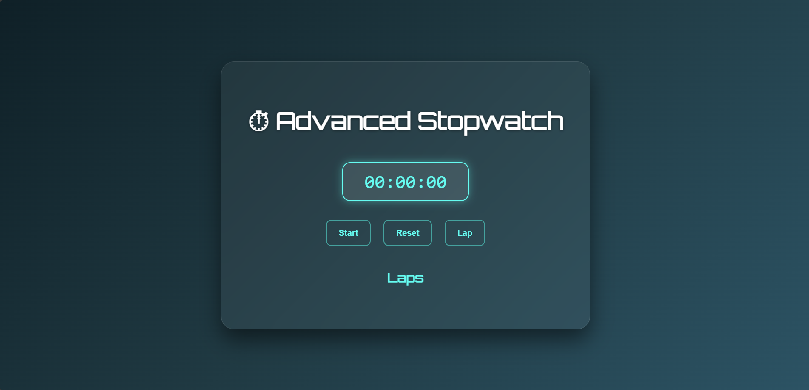

# 🚀 Task 2 - Stopwatch Web App | Prodigy InfoTech Internship

This project is part of my **Web Development Internship at Prodigy InfoTech**.  
It is a fully functional, responsive, and visually appealing **Stopwatch App**, built using **HTML, CSS, and JavaScript**.

---

## 🔥 Features

- Start, Stop, Reset Stopwatch
- Record multiple **Split/Lap Times**
- Displays **Hours:Minutes:Seconds:Milliseconds:Microseconds:Nanoseconds**
- **Beautiful gradient background** and interactive UI
- Responsive design for all screen sizes
- Modern **glassmorphism** design theme

---

## 🌈 Tech Stack

- HTML5
- CSS3 (Gradient backgrounds, transitions, shadows)
- JavaScript (Timers, DOM manipulation)

---

## 📸 Demo

> You can also [🎥 watch the demo video here](./Demo_2.mp4)

---

## 🚀 Live Demo

Coming soon via GitHub Pages!

---

## 🧠 Learning Outcome

- Mastered JavaScript `setInterval`, DOM updates, and time conversions
- Gained experience with responsive layouts and aesthetic design
- Practiced converting milliseconds to detailed time formats (up to nanoseconds)

---

## 🔗 Repository Link

[👉 GitHub Repository - Task 2 Stopwatch App](https://github.com/prakhar-1010/Prodigy_InfoTech/tree/main/Task-2_StopwatchApp)

---
