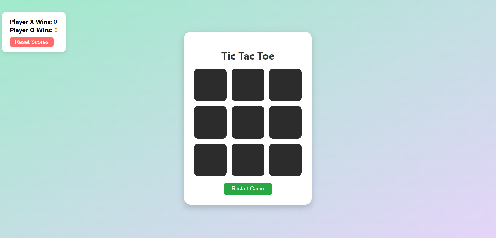

# 🧠 Tic Tac Toe Game - Web Development Task 3

This is a fully functional and interactive **Tic Tac Toe** game built using **HTML**, **CSS**, and **JavaScript**. It is developed as part of **Task 3** for the **Web Development Internship at Prodigy InfoTech**.

---

## 🎮 Features

- 3x3 interactive Tic Tac Toe board
- Playable by two players (X and O)
- Automatically detects the winner or a draw
- Displays a **match result modal** with replay option
- Tracks wins for both Player X and Player O
- **Reset button** to clear match scores
- Responsive and visually appealing UI

---

## 📸 Screenshot




---

## 🛠️ Technologies Used

- **HTML5** – Structure of the game
- **CSS3** – Stylish and responsive design
- **JavaScript (Vanilla)** – Game logic, scoring, event handling

---

## 🚀 Getting Started

### 🔧 Installation

1. Clone this repository:
   ```bash
   git clone https://github.com/prakhar-1010/Prodigy_InfoTech.git
