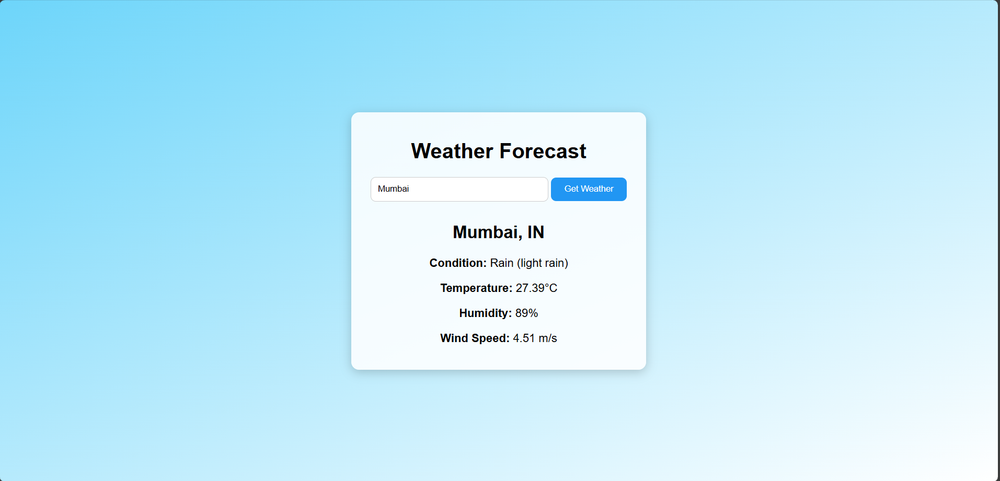

# ☀️ Weather Forecast App - Web Development Task 5

This is a fully responsive and interactive **Weather Forecast Web App** built using **HTML**, **CSS**, and **JavaScript**. It was developed as part of **Task 5** for the **Web Development Internship at Prodigy InfoTech**.

---

## 🌦️ Features

- Get current weather data by **City Name** or **ZIP Code**
- Shows:
  - 🌡️ Temperature (°C)
  - 🌥️ Weather condition
  - 💧 Humidity
  - 🌬️ Wind speed
- Fully responsive design across devices
- Displays errors for invalid locations
- Modern UI and intuitive layout

---

## 📸 Screenshot



> Make sure to add a screenshot named `screenshot.png` in your repo directory for it to appear here.

---

## 🛠️ Technologies Used

- **HTML5** – Page structure  
- **CSS3** – Styling and responsiveness  
- **JavaScript (Vanilla)** – API integration and dynamic DOM updates  
- **OpenWeatherMap API** – Weather data provider

---

## 🚀 Getting Started

### 🔧 Installation

1. Clone this repository:
   ```bash
   git clone https://github.com/prakhar-1010/Prodigy_InfoTech.git
   ```

2. Navigate to the Task 5 folder:
   ```bash
   cd Prodigy_InfoTech/Task-5_WeatherForecastApp
   ```

3. Open `index.html` in your browser.

---

## 🔗 API Used

This project uses the **5-day/3-hour Forecast API** from [OpenWeatherMap](https://openweathermap.org/api):

```
https://api.openweathermap.org/data/2.5/forecast?lat={lat}&lon={lon}&appid={API_KEY}
```

---

## ✅ Status

🟢 Task 5 Completed and submitted for review.
